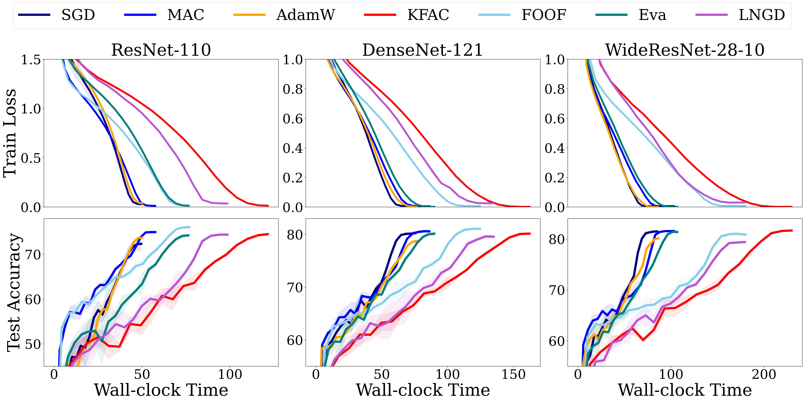

# MAC: An Efficient Gradient Preconditioning using Mean Activation Approximated Curvature

This repository contains the implementation of **MAC**, a lightweight second-order optimizer for deep learning 
that uses mean activation statistics to approximate curvature efficiently. MAC offers a fast and scalable alternative 
to classical second-order methods like KFAC by leveraging a rank-1 curvature approximation and avoiding unstable inversions.

> Accepted at IEEE International Conference on Data Mining (ICDM-2025), Washington DC, USA, November 2025.
---

## Overview

Second-order optimization methods can enhance both convergence speed and generalization performance, but they often 
incur substantial computational and memory costs. **MAC (Mean Activation Curvature)** is a curvature-aware optimizer 
that addresses these challenges through lightweight approximations. It is designed to:
- Precondition gradients using a rank-1 curvature approximation based on batch-averaged activations.
- Improve training stability via decoupled damping.
- Achieve competitive or superior accuracy compared to KFAC, FOOF, and AdamW on CNNs and Vision Transformers, 
while reducing computational overhead.

## Key Features

- **Structural Insights into Curvature Factors**: We conduct an eigenanalysis of the Kronecker factors used in KFAC and 
uncover key structural properties that inform the design of our optimizer.
- **Efficient Optimization with Reduced Training Time**: Leveraging these structural insights, MAC introduces a novel 
preconditioning strategy that reduces end-to-end training time by up to 55.4% compared to KFAC, while maintaining 
memory usage close to that of SGD.
- **First to Apply Kronecker Factorization to Self-Attention**: MAC is the first optimizer to apply Kronecker 
factorization to the Fisher Information Matrix of self-attention layers. It explicitly incorporates attention scores 
into the preconditioner, achieving up to 3.6% higher top-1 accuracy on ImageNet compared to KFAC.

### Benchmark Results
<p align="center">
  
</p>

<p align="center">
  Figure 1: Comparison of train loss and test accuracy over wall-clock time on CIFAR-100 dataset.
</p>

<div style="transform: scale(1.0); transform-origin: top left; width: max-content;">
<table>
  <thead>
    <tr>
      <th rowspan="2">Model</th>
      <th colspan="2">ResNet-50</th>
      <th colspan="2">ResNet-101</th>
      <th colspan="2">DeiT-Small</th>
      <th colspan="2">Swin-Tiny</th>
      <th rowspan="2">Avg.</th>
      <th rowspan="2">Rank</th>
    </tr>
    <tr>
      <th>100</th>
      <th>200</th>
      <th>100</th>
      <th>200</th>
      <th>100</th>
      <th>200</th>
      <th>100</th>
      <th>200</th>
    </tr>
  </thead>

  <tbody>
    <tr>
      <td><strong>MAC</strong></td>
      <td>78.0</td><td>79.7</td>
      <td>79.8</td><td>81.2</td>
      <td>73.5</td><td>77.4</td>
      <td>77.7</td><td>80.1</td>
      <td><strong>78.4</strong></td>
      <td><strong>1</strong></td>
    </tr>
    <tr>
      <td>SGD</td>
      <td>78.1</td><td>79.6</td>
      <td>79.7</td><td>81.3</td>
      <td>69.1</td><td>75.3</td>
      <td>76.0</td><td>78.9</td>
      <td>77.3</td>
      <td>3</td>
    </tr>
    <tr>
      <td>AdamW</td>
      <td>76.8</td><td>79.2</td>
      <td>77.9</td><td>80.6</td>
      <td>73.7</td><td>77.9</td>
      <td>77.4</td><td>80.1</td>
      <td>78.0</td>
      <td>2</td>
    </tr>
    <tr>
      <td>KFAC</td>
      <td>78.2</td><td>79.3</td>
      <td>79.6</td><td>81.1</td>
      <td>69.9</td><td>✗</td>
      <td>✗</td><td>✗</td>
      <td>48.5</td>
      <td>6</td>
    </tr>
    <tr>
      <td>FOOF</td>
      <td>78.4</td><td>79.7</td>
      <td>80.0</td><td>81.0</td>
      <td>63.9</td><td>67.9</td>
      <td>73.7</td><td>72.6</td>
      <td>74.7</td>
      <td>4</td>
    </tr>
    <tr>
      <td>Eva</td>
      <td>77.7</td><td>79.4</td>
      <td>79.6</td><td>81.1</td>
      <td>69.7</td><td>76.6</td>
      <td>✗</td><td>✗</td>
      <td>58.0</td>
      <td>5</td>
    </tr>
  </tbody>
</table>
<p><em>✗ indicates a training failure.</em></p>
</div>
<p align="center">
  Table 1: Top-1 accuracy (\%) of ResNets and ViTs on ImageNet-1k.
</p>

---

## Installation

1. Clone the repository:
```bash
git clone https://github.com/hseung88/mac.git
cd mac
```

2. Create a virtual environment:
```bash
conda env create -n mac -f environments.yml
conda activate mac
```

## Usage

To train a model using MAC on CIFAR:
```bash
python main.py --model resnet110 --optim mac \
--lr 0.1 --momentum 0.9 --stat_decay 0.95 \
--damping 1.0 --tcov 5 --tinv 50  \
--weight_decay 0.0005 --epoch 200 --run 0;
```

For training on ImageNet:
1. **ResNets:** Set `--model` to either `resnet50` or `resnet101`, depending on your choice.
```bash
cd ./pytorch_imagenet
torchrun --nproc_per_node=4 ./train.py --data-path /data/imagenet --model $MODEL \
--batch-size 256 --print-freq 1000 --opt mac --lr 0.5 --damping 1.0 --weight-decay 0.00002 \
--lr-scheduler cosineannealinglr --lr-warmup-epochs 5 --lr-warmup-method linear \
--auto-augment ta_wide --epochs 100 --model-ema --random-erase 0.1 \
--norm-weight-decay 0.0 --label-smoothing 0.1 --mixup-alpha 0.2 --cutmix-alpha 1.0 \
--train-crop-size 176 --val-resize-size 232 --ra-sampler --ra-reps 4 \
--output-dir ./outputs
```
2. **DeiT-Small / Swin-Tiny:** Set `--model` to either `deit_small_patch16_224` or `swin_tiny_patch4_window7_224`, depending on your choice.
```bash
cd ./hf_imagenet
torchrun --nproc_per_node=4 ./train.py --model $MODEL --sched cosine \
--epochs 100 --opt mac --lr 0.5 --damping 3.0 --tcov 5 --tinv 5 --stat_decay 0.99 \
--weight-decay 0.0001 --workers 16 --warmup-epochs 5 --warmup-lr 0.05 --min-lr 0.0 \
--batch-size 256 --aug-repeats 3 --aa rand-m9-mstd0.5-inc1 --smoothing 0.1 \
--remode pixel --reprob 0.25 --drop 0.0 --drop-path 0.0 --mixup 0.8 --cutmix 1.0 \
--data-dir /scratch/hs70639/data/imagenet --pin-mem True --amp --log-interval 1000;
```

---

## Citation
```bash
@inproceedings{seung2025mac,
  title={MAC: An Efficient Gradient Preconditioning using Mean Activation Approximated Curvature},
  author={Seung, Hyunseok and Lee, Jaewoo and Ko, Hyunsuk},
  booktitle={IEEE International Conference on Data Mining},
  year={2025}
}
```